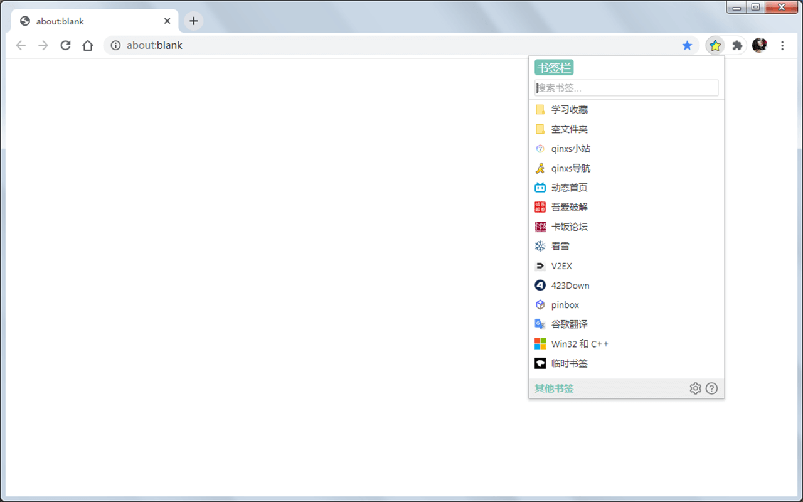

# Ease Bookmarks

> 简单易用的书签管理器

Ease Bookmarks 是一款为了替代浏览器原有书签栏的扩展

在此基础上，尽可能满足各类 书签使用习惯 用户的需求

## 主要功能

修改书签的默认打开方式

对书签的各种基本操作（编辑、删除、移动等）

书签多列显示

快捷键支持

~~在未使用本扩展时，不占用后台~~

另外，本扩展对 `JS 小书签` 进行了特别支持~

> 更新日志：[ChangeLog.md](ChangeLog.md)
> 
> 查看所有截图：[Screenshots](./screenshots/README.md#所有截图)
>
> 常见问题：[FAQ](https://github.com/qinxs/Ease-Bookmarks/wiki/常见问题（FAQ）)

## 使用快捷键

### 打开/关闭 本扩展

默认快捷键是 `Ctrl + Q`，你可以在如下管理页面进行修改：
- **Chrome**：`chrome://extensions/shortcuts`
- **Edge**：`edge://extensions/shortcuts`

<!-- - Firefox：`about:addons` -> 扩展 -> 设置图标 -> 管理扩展快捷键 -->

### 功能键

- `上`、`下`、`左`、`右`、`Home`、`End`：选择/切换 书签
- `Enter`：打开选中的 书签/目录
- `Space`：取消选中
- `F2`：编辑 书签/目录（`Enter` 保存；`Esc`、`F2` 取消）
- `Tab`：返回上一级目录
- `Ctrl + Z`：切换到 书签栏/其他书签
- `Ctrl + F`：激活搜索框
- `Esc`：清除搜索框内容；关闭页面

### 修饰键

- `Ctrl`：在 当前标签/新标签 打开页面
- `Shift`：是否在后台打开页面

## 自定义

- 别名（书签栏和其他书签，其他语言可能会需要）
- 自定义样式（popup 页面，DOM 结构可在 header 区域 `右键 -> 检查` 查看）

## 控制台设置

不常用选项没有展现在选项页面，需通过扩展控制台开启

如何操作：扩展图标 `右键 -> 审查弹出内容` 打开控制台

然后通过执行 BM.set(name, value) 以改变配置，如：`BM.set('fastCreate', 2)`

### `fastCreate`

> 功能：中键点击**书签favicon图标**，快速把当前网址添加到书签（详见 #15）

- `0`：默认值，不启用
- `2`：启用，只对文件夹有效，书签添加到该文件夹中

### `keepMaxCols`

> 功能：页面保持最大宽度

- `0`：页面宽度始终与当前内容一致
- `1`：默认值，页面宽度与（打开过的）页面的最大宽度一致（能避免切换文件夹时的页面跳动）

### `updateBookmarkOpt`

> 功能：菜单 `更新为当前网址` 的更新选项

- `1`：默认值，仅更新 url
- `2`：同时更新 url 和 title

## 翻译
> 通过以下方式翻译，如有不当，请提 issue 指明，感谢~

- `chrome://bookmarks/` -> `F12`，[参考](docs/chrome_bookmarks.png)
- Chrome 的 pak 文件，路径`Chromium\94.0.4606.81\Locales`
  > 使用 `ChromePAK解包打包工具.exe` 解包搜索对比
- [Microsoft Translator](https://cn.bing.com/translator)，并用其他翻译验证

## 第三方库

[dragula.js](https://github.com/bevacqua/dragula)（进行了细微调整 [改动内容](https://github.com/qinxs/dragula2)）

[marked](https://github.com/markedjs/marked)（动态渲染 markdown 文件）

## License

[MIT](LICENSE)
