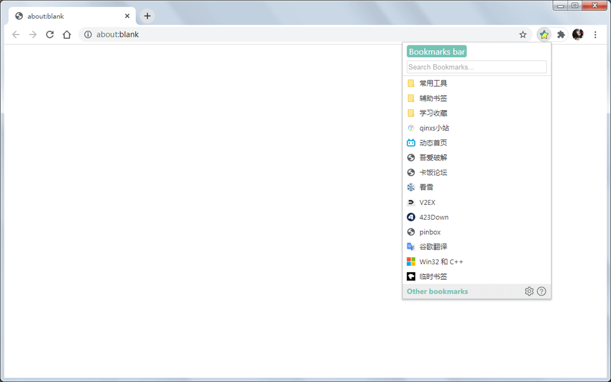

[//]: #

 
<i>A Simple and Easy-to-Use Bookmarks Manager</i>
<h1>Ease Bookmarks</h1>

 

  

Ease Bookmarks is a browser extension designed to replace the native bookmarks bar.

It aims to accommodate the bookmark usage habits of various users while maintaining simplicity.

## Key Features

Modify the default opening behavior of bookmarks

Perform basic operations on bookmarks (edit, delete, move, search, etc.)

Multi-column display for bookmarks

Keyboard shortcut support

Special support for `JS bookmarklets`

> Changelog: [ChangeLog.md](ChangeLog.md)
> 
> View all screenshots: [Screenshots](./screenshots/README.md#所有截图)
>
> FAQs: [FAQ](https://github.com/qinxs/Ease-Bookmarks/wiki/常见问题（FAQ）)

## Keyboard Shortcuts

### Turn this extension on/off

The default shortcut is `Ctrl + Q`, You can modify it via:
- **Chrome**: `chrome://extensions/shortcuts`
- **Edge**: `edge://extensions/shortcuts`
- **Firefox**: `about:addons` `Settings Icon` `Manage Extension Shortcuts`

### Functional keys

- `↑`, `↓`, `←`, `→`, `Home`, `End`: select/toggle bookmarks
- `Enter`: open the selected bookmark/folder
- `Space`: cancel selection
- `F2`: edit bookmark/folder (Enter to save; Esc/F2 to cancel)
- `Tab`: go back to the previous folder
- `Ctrl + Z`: switch between "Bookmarks bar" and "Other bookmarks"
- `Ctrl + F`: activate the search box
- `Esc`: clear the search box content; close the page

### Modifier keys

- `Ctrl`: whether to open the page in the background
- `Shift`: open page in current tab/new tab

## Customize

- Aliases (bookmarks bar and other bookmarks, may be required for other languages)
- Custom style (`popup` page, DOM structure can be viewed in the header area `Right click -> Inspect`)

## Built-in Parameters

Used to switch/adjust niche features within this plugin (or the default behavior of the browser itself)

Configure at (`/options.html#configTable`)

| Parameter / Feature                                                     | Description                                                                                                                                 |
| ----------------------------------------------------------------------- | ------------------------------------------------------------------------------------------------------------------------------------------- |
| `bodyWidth_*`          Adjust popup width for multi-column layout     | Maximum effective value is 800px due to Chrome extension limits                                                                             |
| `compositionEvent`     Enable composition event for search input      | - `0`: Disabled (default)                - `1`: Enabled     Note: Always enabled for Chinese IME                                        |
| `fastCreate`           Middle-click favicon to quickly add bookmark   | - `0`: Disabled (default)                - `2`: Enabled and only works for folders (add bookmarks to the folder)    （more details [#15][issues-15]） |
| `faviconAPI`           [ firefox only ] Favicon fetching API          | Supported placeholders: {hostname} {origin}   （[ more details ][issues-firefox]）                                                       |
| `hotkeyCancelSeleted`  Deselect hotkey                                | - `Space`: Space key, on (default)       - `-Space`: Disable     Other `hotkey*` params follow same pattern (prepend - to disable key)   [JavaScript Key Code][keycode]（Use the event.code value） |
| `hotkeyDelete`         Delete bookmark hotkey                         | - `-Delete`: Delete key, off (default)                                                                                                       |
| `keepLastSearchValue`  Restore last search keywords                   | - `0`: Disabled (default)                - `1`: When openning the popup window, the last search keywords and search results are restored.  |
| `keepMaxCols`          Maintain maximum popup width                   | - `0`: Dynamic width                     - `1`: Maintain maximum opening width (default, prevents layout jumps)                            |
| `openBookmarkAfterCurrentTab` Open bookmarks after current tab        | - `0`: Disabled (default)                - `1`: Enabled (only works when opened via this extension)                                        |
| `searchResultSort`     Search result sorting                          | - `1`: Name ascending (default)          - `0`: Native order, Same as searching in `chrome://bookmarks/`   - `-1`: Name descending        |
| `updateBookmarkOpt`    "Update to Current URL" menu behavior          | - `1`: Update URL only (default)         - `2`: Update both URL and title                                                                  |

## Localization
*Translated in the following way, if there is any inaccuracy, please create [issue][issues-page] to point it out, thank you~*

- `chrome://bookmarks/` -> `F12`，[reference](docs/chrome_bookmarks.png)
  > Access `chrome://bookmarks/strings.m.js` for translation strings
- Chrome PAK files, path: `Chromium\94.0.4606.81\Locales`
  
  > Use `ChromePAK解包打包工具.exe` to unpack and search
- [Microsoft Translator](https://cn.bing.com/translator), and verified with other tools

## Third-Party Libraries

[dragula.js](https://github.com/bevacqua/dragula) (with minor adjustments [here](https://github.com/qinxs/dragula2))

[marked](https://github.com/markedjs/marked) (dynamic markdown rendering)

## License

[MIT](LICENSE)

[issues-page]: https://github.com/qinxs/Ease-Bookmarks/issues
[issues-15]: https://github.com/qinxs/Ease-Bookmarks/issues/15
[issues-firefox]: https://github.com/qinxs/Ease-Bookmarks/issues/42
[keycode]: https://www.toptal.com/developers/keycode
